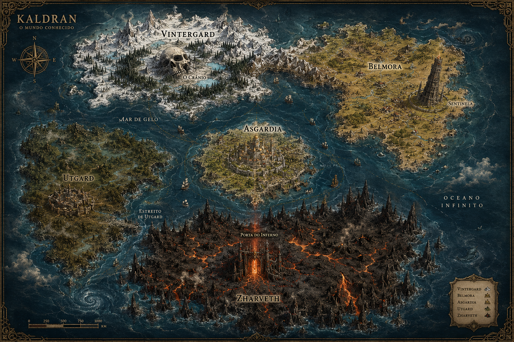

# Dragon Souls: Kaldran

Repositorio de organizacao da lore oficial de **Dragon Souls: Kaldran**.

Este projeto funciona como uma enciclopedia do mundo de **Kaldran**, reunindo continentes, cidades, povos, faccoes, religioes, criaturas, magia, conflitos, personagens, locais perigosos e eventos historicos.

## Regra principal

Somente informacoes enviadas pelo criador sao consideradas lore oficial.

Quando uma informacao ainda nao foi definida, ela deve permanecer marcada como:

> Ainda nao definido pelo criador.

## Navegacao

- [Mapa de Kaldran](mapa/kaldran/README.md)
- [Historia](historia/README.md)
- [Povos](povos/README.md)
- [Faccoes](faccoes/README.md)
- [Religioes](religioes/README.md)
- [Personagens](personagens/README.md)
- [Criaturas](criaturas/README.md)
- [Magia](magia/README.md)
- [Culturas](culturas/README.md)
- [Conflitos](conflitos/README.md)
- [Notas](notas/ideias-soltas.md)

## Estado oficial atual

- Mundo: **Kaldran**
- Projeto: **Dragon Souls: Kaldran**
- Kaldran ja foi um supercontinente quebrado.
- Atualmente, Kaldran e dividido em cinco continentes principais.
- A magia em Kaldran nao e energia solta: magia e codigo espiritual executado por Runas.
- Humanos sao descendentes ocos dos Valerianos.
- O Imperio Sagrado trata Valerianos como deuses.

## Mapa oficial

## Continentes oficiais

1. [Vintergard](mapa/kaldran/continentes/vintergard/README.md)
2. [Belmora](mapa/kaldran/continentes/belmora/README.md)
3. [Zharveth](mapa/kaldran/continentes/zharveth/README.md)
4. [Asgardia](mapa/kaldran/continentes/asgardia/README.md)
5. [Utgard](mapa/kaldran/continentes/utgard/README.md)

## Marcos oficiais

- [O Cranio](mapa/kaldran/continentes/vintergard/locais/o-cranio.md)
- [Sentinela](mapa/kaldran/continentes/belmora/locais/sentinela.md)
- [Porta do Inferno](mapa/kaldran/continentes/zharveth/locais/porta-do-inferno.md)

## Lore central

- [Capitulo I - A Guerra da Ruptura e a Quebra do Codigo](historia/capitulos/capitulo-01-guerra-da-ruptura.md)
- [Guerra da Ruptura](historia/eventos/guerra-da-ruptura.md)
- [Valerianos](povos/valerianos.md)
- [Runas](magia/runas.md)
