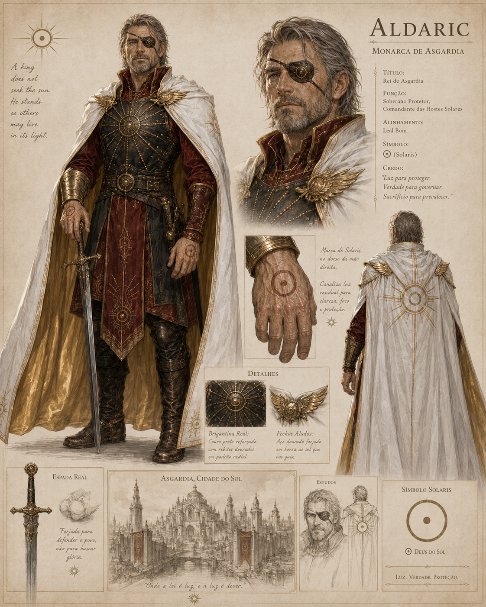

# Aldaric

## Visao Geral

Aldaric e o monarca de Asgardia.

## Informacoes Oficiais

- Nome: Aldaric.
- Titulo: Rei de Asgardia.
- Funcao: Soberano Protetor.
- Funcao: Comandante das Hostes Solares.
- Alinhamento: Leal Bom.
- Simbolo: Solaris.
- Credo: "Luz para proteger. Verdade para governar. Sacrificio para prevalecer."
- Usa a Marca de Solaris no dorso da mao direita.
- A Marca de Solaris canaliza luz residual para clareza, foco e protecao.
- Usa brigantina real com couro preto reforcado e rebites dourados em padrao radial.
- Usa fechos alados de acao dourado forjado em honra ao sol que guia.
- Porta a Espada Real.
- A Espada Real foi forjada para defender o povo, nao para buscar gloria.

## Aparencia

Aldaric e retratado com cabelos grisalhos, barba curta, tapa-olho com simbolo solar, armadura escura com detalhes dourados e manto branco com interior dourado.

## Asgardia

A imagem apresenta Asgardia como **Asgardia, Cidade do Sol**.

Frase associada a cidade:

> "Onde a lei e luz, e a luz e dever."

## Relacoes

- [Asgardia](../mapa/kaldran/continentes/asgardia/README.md)
- [Imperio Sagrado](../faccoes/imperio-sagrado.md)
- [Solaris](valerianos/solaris.md)
- [Cavaleiro Santo](cavaleiro-santo/README.md)

## Pendencias

- Definir se Aldaric e o rei atual de todo o Imperio Sagrado ou apenas de Asgardia.
- Definir a relacao exata de Aldaric com Solaris.
- Definir se Aldaric possui Runa propria, marca concedida ou outro tipo de vinculo com Solaris.

