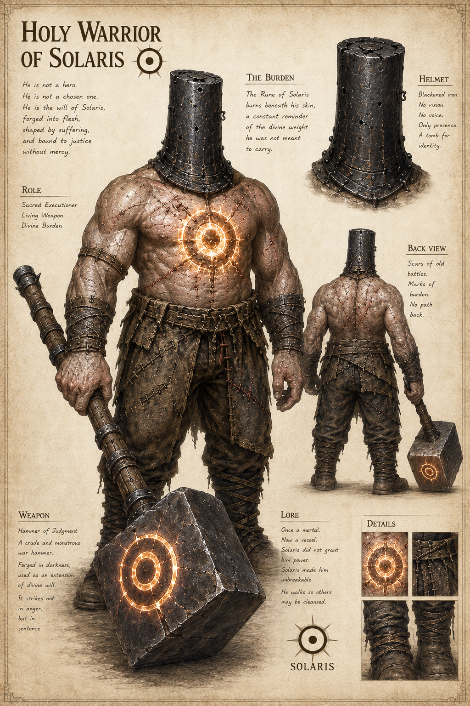

# Cavaleiro Santo

## Visao Geral

O Cavaleiro Santo e o campeao singular de Solaris: um humano transformado em avatar de guerra pela Marca extrema cravada no coracao.

## Informacoes Oficiais

- O Cavaleiro Santo e o braco armado pessoal de Solaris.
- Nao e apenas um soldado de elite, oficial abencoado ou homem com a Marca comum.
- O Cavaleiro Santo e escolhido a dedo para missoes que a infantaria comum nao pode cumprir, que o Rei nao pode ordenar e que a Igreja prefere negar.
- A Marca do Cavaleiro Santo e gravada diretamente no coracao.
- O ritual de ascensao mata a maioria dos candidatos.
- O Cavaleiro Santo bombeia o codigo de Solaris pelo sangue.
- O Cavaleiro Santo e um avatar vivo e mortal da Purificacao Absoluta.
- O Cavaleiro Santo nao e Valeriano.
- O Cavaleiro Santo nao possui Runa na alma.
- A Runa de Solaris queima sob a pele do Cavaleiro Santo como lembranca constante do peso divino que ele nao deveria carregar.
- Ele nao e um heroi.
- Ele nao e um escolhido.
- Ele e descrito como a vontade de Solaris forjada em carne, moldada pelo sofrimento e presa a justica sem misericordia.
- Ele ja foi mortal.
- Agora e um recipiente.
- Solaris nao lhe concedeu poder; Solaris o tornou inquebravel.
- Ele caminha para que outros sejam purificados.

## Detalhes

### Aparencia

O Cavaleiro Santo e retratado como uma figura extremamente corpulenta, sem rosto visivel, com um elmo cilindrico de ferro enegrecido.

Seu corpo possui cicatrizes de batalhas antigas e marcas de fardo. A visao posterior indica que nao ha caminho de volta.

### Elmo

- Ferro enegrecido.
- Sem visao.
- Sem voz.
- Apenas presenca.
- Um tumulo para a identidade.

### Martelo do Julgamento

O Cavaleiro Santo usa o Martelo do Julgamento.

O Martelo do Julgamento e uma arma de guerra crua e monstruosa, forjada na escuridao, usada como extensao da vontade divina.

Ele nao golpeia com raiva, mas em sentenca.

### A Espada do Sol

Quando o Cavaleiro Santo se move, nao e o Imperio que caminha. E Solaris.

### A Cirurgia Arcana

A Marca comum de Solaris e gravada na mao direita. A Marca do Cavaleiro Santo e cravada no coracao.

Literalmente ou por meios arcanos, o peito do candidato precisa ser aberto. O codigo de Solaris e inscrito diretamente no musculo cardiaco pulsante, onde a carne humana nao foi feita para receber uma matriz divina.

A maioria morre. Alguns entram em combustao, enlouquecem antes do ritual terminar, tem os orgaos derretidos pela pressao da Runa ou deixam de existir como pessoas antes mesmo que o corpo pare de respirar.

Nao e um teste de coragem. E uma sentenca com pequena margem de sobrevivencia.

### Sangue Runico

Cada batimento bombeia o codigo de Solaris pelo corpo inteiro. A Runa deixa de ser uma ancora na pele e passa a circular com o sangue.

O Cavaleiro Santo deixa de apenas canalizar poder. Ele passa a respira-lo.

Cada musculo recebe a ordem. Cada nervo recebe a luz. Cada osso aprende a obedecer. Cada gota de sangue carrega o eco do Deus do Sol.

### Paradoxo de Solaris

A Marca comum de Solaris nao doi. Ela e limpa, indolor, precisa e controlada.

A Marca do Cavaleiro Santo e o oposto. Para criar seu campeao, Solaris coloca sua Chama Branca diretamente no coracao de um mortal. A purificacao invade e queima toda fraqueza humana de dentro para fora.

Para Solaris, o sofrimento do ritual nao e crueldade. E filtragem.

## Relacoes

- [Solaris](../valerianos/solaris.md)
- [Imperio Sagrado](../../faccoes/imperio-sagrado.md)
- [Runa de Solaris](../../magia/runas/runa-de-solaris.md)
- [Marca do Cavaleiro Santo](../../magia/marcas/marca-do-cavaleiro-santo.md)
- [Mecanica da Marca](../../magia/mecanica-da-marca.md)

## Pendencias

- Definir o nome do Cavaleiro Santo atual.
- Definir se ja existiram outros Cavaleiros Santos.
- Definir onde o ritual de ascensao e realizado.
- Definir se o Martelo do Julgamento e a arma atual oficial do Cavaleiro Santo ou uma variacao especifica.
