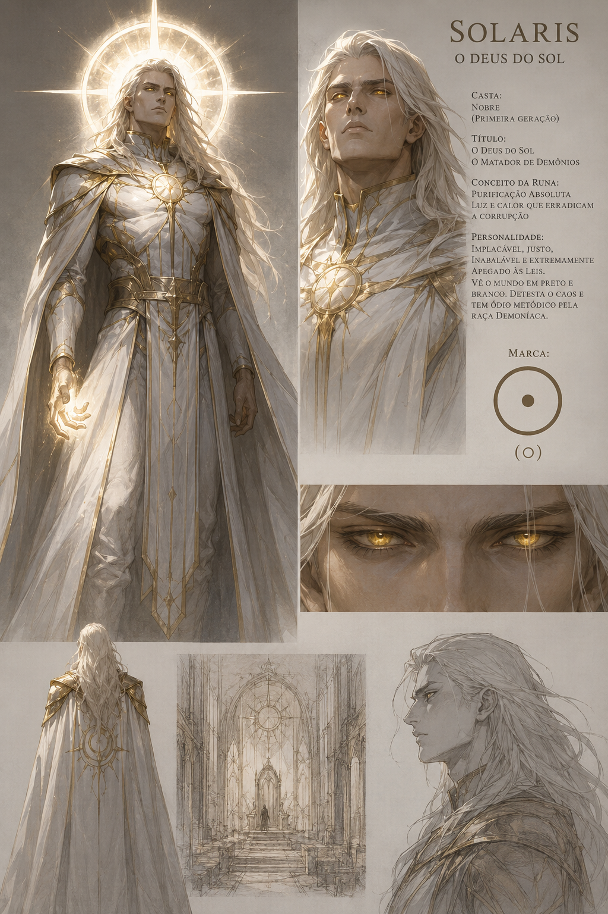

# Solaris

## Visao Geral

Solaris e um Valeriano Nobre da Primeira Geracao, venerado pelo Imperio Sagrado como Deus do Sol. Ele e a fonte original da Runa imperial, a base da autoridade de Asgardia e o eixo institucional que sustenta o rei, a Igreja e o exercito.

## Informacoes Oficiais

- Solaris e o nome verdadeiro dele.
- Solaris e um Valeriano Nobre da Primeira Geracao.
- Solaris e chamado de Deus do Sol.
- Solaris e tambem chamado de Primeiro Escudo e Matador de Demonios.
- Solaris e implacavel, justo, inabalavel e legalista.
- Solaris enxerga o mundo em preto e branco.
- Solaris odeia o caos.
- Solaris possui odio metodico e estrategico pela raca demoniaca.
- Sua aparencia transmite autoridade esmagadora.
- Seus olhos parecem ouro liquido.
- A Runa de Solaris representa Purificacao Absoluta.
- A Marca de Solaris e um circulo perfeito com um ponto no centro: **⊙**.
- Solaris e a base do poder de Asgardia.
- O Rei governa em nome de Solaris.
- Solaris protege a capital.
- Solaris fornece sua Runa aos exercitos imperiais.
- Solaris e aliado da humanidade, mas punira humanos que violarem suas leis.
- O Rei vive em reverencia e medo diante de Solaris.
- Asgardia so existe porque Solaris permite.
- Solaris nao governa o Imperio diretamente no papel.
- O Rei governa o Imperio no Palacio Imperial.
- Solaris governa a legitimidade do Rei a partir da Cidadela Eclesiastica.
- Solaris raramente aparece em publico.
- Solaris recebe apenas o Rei e a cupula da Igreja.
- Solaris aparece publicamente no Dia da Purificacao para marcar novos batalhoes.
- Solaris decapitou o Lorde Demonio que comandava a resistencia final em Asgardia nos ultimos dias da Guerra da Ruptura.
- Solaris possui um campeao singular chamado [Cavaleiro Santo](../cavaleiro-santo/README.md).

## Detalhes

### Referencia Visual Oficial

### Natureza

Solaris nao e apenas um dos seres mais antigos ainda vivos em Kaldran. Ele e uma das matrizes runicas mais puras, primitivas e devastadoras remanescentes da linhagem Valeriana.

Para o Imperio Sagrado, Solaris e o Deus do Sol. Para os soldados de Asgardia, e o poder que corre por suas Marcas. Para os demonios, e uma sentenca.

### Personalidade

Solaris e implacavel, justo, inabalavel e extremamente apegado as leis.

Ele enxerga o mundo em opostos absolutos: ordem e corrupcao, lei e transgressao, pureza e contaminacao, obediencia e ameaca.

Solaris detesta o caos nao por medo, mas por principio. Para ele, o caos e a primeira rachadura por onde a corrupcao entra. Por isso, sua justica nao e calorosa, misericordiosa ou humana. E solar: clara, direta, ofuscante e sem sombra para esconder culpa.

Seu odio pelos demonios nao e descontrolado. Nao e um acesso de furia. E metodico, estrategico e absoluto. Solaris nao odeia como um homem odeia. Ele odeia como uma lei natural rejeita uma infeccao.

### Aparencia

Solaris possui postura rigida e majestosa. Sua presenca parece ordenar o espaco ao redor.

Antes mesmo de falar, ele impoe silencio. Humanos comuns sentem sua aura como um peso fisico sobre os ombros, uma pressao invisivel que obriga a coluna a se curvar e a respiracao a medir cada movimento.

Seus olhos parecem ouro liquido: vivos, ardentes e quase impossiveis de encarar por muito tempo.

Solaris nao precisa gritar, gesticular ou ameacar. A ameaca esta no fato de que ele permanece perfeitamente calmo.

### Estrutura de Poder em Asgardia

O poder temporal e o poder divino sao separados geograficamente em Asgardia. O Rei vive no Palacio Imperial, cercado pela maquina humana do Imperio: ministros, generais, escribas, cobradores de impostos, mapas de guerra, burocracia, economia, decretos, aliancas, punicoes e campanhas militares.

Solaris habita a [Cidadela Eclesiastica](../../mapa/kaldran/continentes/asgardia/capital/cidadela-eclesiastica.md), um complexo de castelos, torres sagradas, muralhas internas e saloes liturgicos erguido no coracao religioso da cidade.

Solaris nao desce as pracas para ouvir suplicas, nao visita mercados, nao atravessa bairros pobres e nao se mistura ao povo que o adora. Essa distancia e parte de sua construcao de poder: quanto menos ele aparece, mais sua presenca pesa.

Em Asgardia, o Rei governa o Imperio, mas Solaris governa a legitimidade do Rei.

Asgardia nao governa porque e livre. Asgardia governa porque Solaris permite.

### Dia da Purificacao

O Dia da Purificacao e o maior evento militar e religioso de Asgardia. Nesse dia, Solaris aparece diante do povo e marca os novos batalhoes.

A Marca comum de Solaris e aplicada nas costas da mao direita dos recrutas, a mao que empunha a espada. A Marca e limpa, indolor e precisa.

Para o Imperio, a Marca e bencao. Para seus inimigos, e producao em massa.

### Matador de Demonios

Nos ultimos dias da Guerra da Ruptura, quando os ultimos exercitos demoniacos tentavam resistir em solo asgardiano, Solaris avancou contra o lider da invasao e decapitou o Lorde Demonio que comandava a resistencia final em Asgardia.

Esse ato nao encerrou sozinho toda a Guerra da Ruptura, mas consolidou sua lenda como Matador de Demonios.

Solaris nao negociou com a invasao, nao recuou diante da biologia infernal e nao purificou por misericordia, mas por eliminacao.

### Relacao com o Imperio Sagrado

O Rei venera Solaris e governa em seu nome. Toda autoridade imperial existe a sombra da permissao de Solaris.

Em troca, Solaris protege a capital e fornece sua Runa para os exercitos imperiais.

Essa relacao nao e simples devocao. E dependencia politica.

Se Solaris retirasse sua protecao, o Imperio perderia seu coracao. Se Solaris negasse sua Marca, o exercito perderia sua padronizacao sagrada. Se Solaris julgasse o Rei indigno, a coroa se tornaria apenas metal sobre uma cabeca condenada.

Solaris e aliado da humanidade, mas nao e servo dela.

Os humanos sabem que, se quebrarem suas leis, a purificacao recaira sobre eles com a mesma forca que recai sobre demonios.

### Papel em Kaldran

Solaris representa a ordem levada ao limite.

Para muitos, Solaris e o escudo que impede o Inferno de retornar. Para outros, e apenas outro tipo de fogo esperando permissao para queimar.

### Xadrez dos Deuses

A raca Valeriana nao e unida. Outros Nobres e Valerianos reclusos observam Solaris com repulsa, cautela ou desprezo.

Para alguns, Solaris e um hipocrita arrogante: um sobrevivente antigo brincando de ser rei sobre uma raca oca. Para outros, e algo pior: um Valeriano que transformou a tragedia do sangue em sistema politico.

A presenca de tantos humanos carregando a mesma matriz runica incomoda profundamente os Valerianos que recusam culto, adoracao e comercio das Marcas. As tensoes entre os "deuses" de Asgardia formam uma guerra fria constante.

Asgardia permanece inteira nao por harmonia divina, mas por conveniencia estrategica.

## Relacoes

- [Imperio Sagrado](../../faccoes/imperio-sagrado.md)
- [Asgardia](../../mapa/kaldran/continentes/asgardia/README.md)
- [Cidadela Eclesiastica](../../mapa/kaldran/continentes/asgardia/capital/cidadela-eclesiastica.md)
- [Runa de Solaris](../../magia/runas/runa-de-solaris.md)
- [Marca de Solaris](../../magia/marcas/marca-de-solaris.md)
- [Cavaleiro Santo](../cavaleiro-santo/README.md)
- [Guerra da Ruptura](../../historia/eventos/guerra-da-ruptura.md)
- [Valerianos](../../povos/valerianos.md)

## Pendencias

- Definir o nome civil ou historico do Rei de Asgardia.
- Definir quais membros formam a cupula da Igreja.
- Definir outros Valerianos presentes em Asgardia.
- Definir o nome do Lorde Demonio decapitado por Solaris.
- Definir se Solaris ja purificou humanos em massa.
- Definir se Solaris teme algo.
- Definir quais Valerianos odeiam Solaris diretamente.
